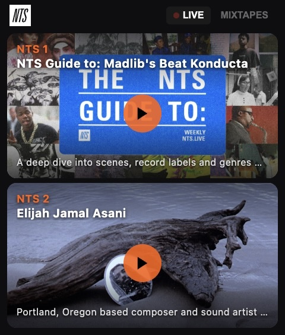

# NTS Radio for Rabbit R1

A native streaming app for the Rabbit R1 that brings NTS Radio's live channels and infinite mixtapes to your device.



## Features

- **Live Streaming** — Listen to NTS 1 and NTS 2 live channels
- **Infinite Mixtapes** — 16 curated music-only themed streams (ambient, house, jazz, hip-hop, and more)
- **Beautiful UI** — Full-card artwork with dual gradient overlays, optimized for the 240×282px R1 screen
- **Smart Controls**
  - Scroll wheel: Volume when music is playing, browse mixtapes when not
  - Side button: Play/pause
  - Tap cards to start/stop playback
- **Visual Feedback** — Animated audio visualizer on playing cards, floating volume toast

## Installation on R1

### Via QR Code (Recommended)

1. Open the QR code page: https://app-murex-seven-71.vercel.app/qr.html
2. Point your R1's camera at the QR code
3. The R1 will register the creation and add it to your creations list

### Manual Installation

1. Deploy the app to a public URL (see Deployment below)
2. In the Rabbithole, add the URL as a custom creation

## Development

```bash
cd apps/app
npm install
npm run dev
```

Open http://localhost:5173 to test in your browser.

### Keyboard Controls (Dev Mode)

- `Space` — Side button (play/pause)
- `Arrow Up/Down` — Scroll wheel (volume/mixtape browse)
- `Arrow Left` — Switch to LIVE tab
- `Arrow Right` — Switch to MIXTAPES tab

## Building

```bash
npm run build
```

The built files will be in `dist/`.

## Deployment

The app is deployed on Vercel: https://app-murex-seven-71.vercel.app

### Deploy to Vercel

```bash
npx vercel login
npx vercel deploy --prod
```

### Deploy to Netlify

```bash
npm run build
npx netlify-cli deploy --prod --dir=dist
```

### QR Code Generation

The `qr.html` file generates an install QR code. Update the `url` in the script section to match your deployed URL, then open it in a browser to generate a scannable code.

## API Endpoints

- **Live shows**: `https://www.nts.live/api/v2/live`
- **Stream 1**: `https://stream-relay-geo.ntslive.net/stream`
- **Stream 2**: `https://stream-relay-geo.ntslive.net/stream2`
- **Mixtapes**: `https://stream-mixtape-geo.ntslive.net/mixtape*`

## Known Limitations

- NTS supporter login and archive access require Mixcloud/Soundcloud (no direct streaming API)
- Mixtape artwork URLs are from the NTS website; some may be reused across mixtapes

## Tech Stack

- Vanilla JavaScript (ES modules)
- Vite for build tooling
- HTML5 Audio for playback
- CSS Grid/Flexbox for layout
- R1 Creations SDK for hardware events

## License

MIT
